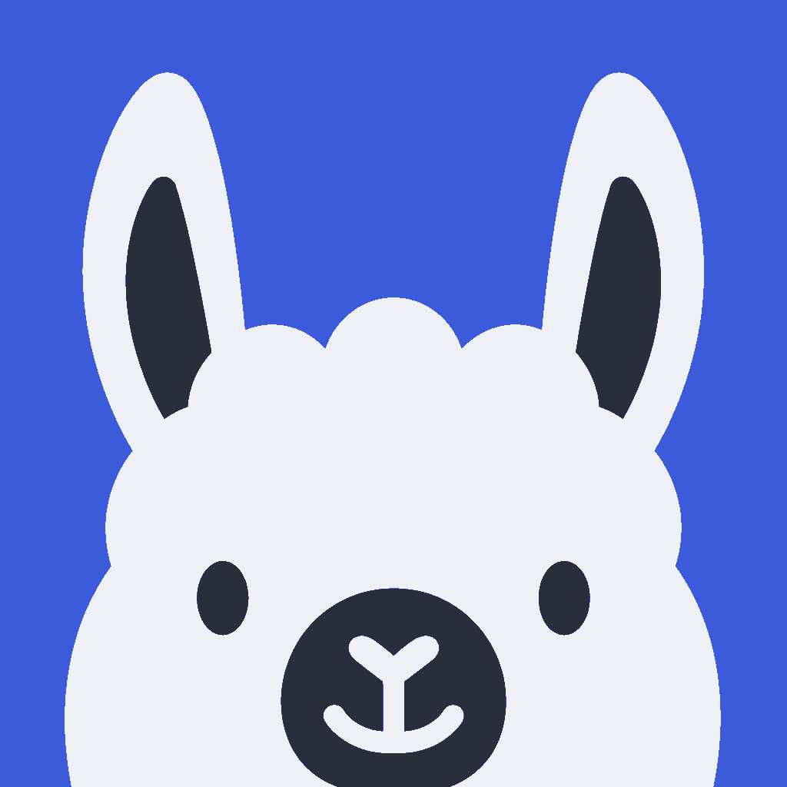
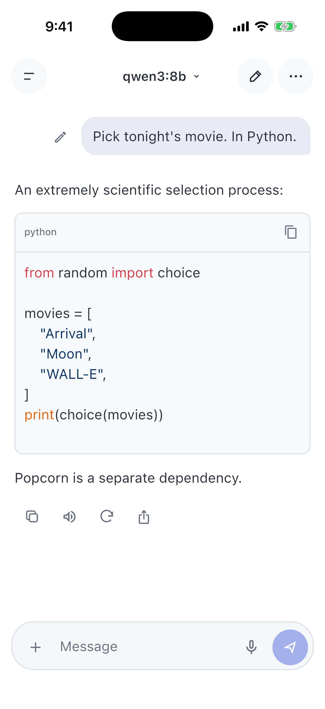
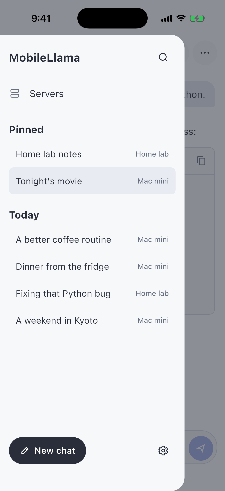
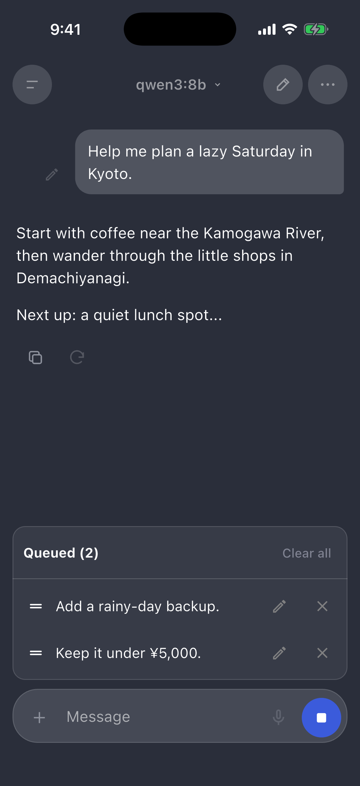

<p align="center">
  
</p>

<h1 align="center">MobileLlama</h1>

<p align="center">
  <strong>Your models, from your phone.</strong><br />
  A free, open-source chat client for Ollama, OpenAI-compatible servers, and Open WebUI.
</p>

<p align="center">
  <a href="#get-started">Get started</a> ·
  <a href="#features">Features</a> ·
  <a href="https://github.com/IluvatarLabs/mobilellama/issues">Bugs & ideas</a>
</p>

<table align="center">
  <tr>
    <th align="center">Chat & code</th>
    <th align="center">Your saved chats</th>
    <th align="center">Keep the questions coming</th>
  </tr>
  <tr>
    <td><a href="docs/screenshots/chat.png"></a></td>
    <td><a href="docs/screenshots/chats.png"></a></td>
    <td><a href="docs/screenshots/queue.png"></a></td>
  </tr>
</table>

<p align="center"><sub>iOS screenshots with demo conversations.</sub></p>

Use the models running on your Mac, home server, or a hosted API from your
iPhone. Built with Flutter, with iOS as the primary platform. Android
contributions are welcome.

## Features

- Multiple servers and models, flexible API roots and authentication, and Chat Completions or Responses
- Streaming replies, retained answer versions, and editable follow-up queues
- Saved drafts and offline history with search, pins, archives, and folders
- Images, PDF and text attachments, iOS share intake, image paste, dictation, and read-aloud
- Markdown, highlighted code, math, supported Mermaid diagrams, and portable backups
- Optional Open WebUI accounts with shared history, server files, knowledge, prompts, skills, and configured tools
- Separate temporary chats with an explicit Save action
- Custom instructions, reusable presets, and light and dark themes

## Get started

You'll need a reachable Ollama, OpenAI-compatible, or Open WebUI server. Models
run on that server; MobileLlama is the client. Direct connections do not require
an Open WebUI account.

To run from source, install Flutter with Dart 3.13.2 or later, Xcode, and
CocoaPods on a Mac. Start an iOS simulator, then run:

```sh
git clone https://github.com/IluvatarLabs/mobilellama.git
cd mobilellama
flutter pub get
flutter run --dart-define=MOBILELLAMA_ICLOUD=false
```

For iPhone signing and other build options, see [Building](docs/building.md).

In the app, tap **Connect a server**, choose the connection type, enter its URL
and any required API key, tap **Save and connect**, then choose a model.
Settings › Help & About has the same guidance offline. Ollama URLs usually look like `http://192.168.1.10:11434`;
OpenAI-compatible URLs use the API root provided by your service, often ending
in `/v1`; deployment prefixes and other API roots are supported. For Open WebUI,
use the server's root URL and an existing account or a permitted API key.
Use your server's LAN address when
connecting from a phone—`localhost` means the phone itself.

Shared content is staged by the iOS extension. Open MobileLlama afterward to
review its destination and editable draft before sending. Temporary chat omits
local saved history until you choose Save; the selected server can still log
requests. Open WebUI temporary sessions are text-only and require live events.

See [update and validation notes](docs/update-validation.md) for tested server
versions, migration behavior, and the remaining release checks.

## Contributing

Found a bug or have an idea? [Open an issue](https://github.com/IluvatarLabs/mobilellama/issues).
Pull requests are welcome. See [Building](docs/building.md) for setup and tests.

## License

[Apache-2.0](LICENSE).
